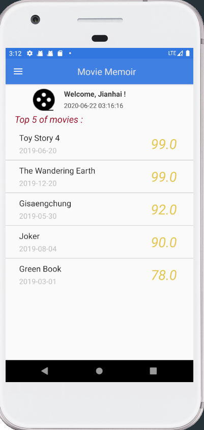
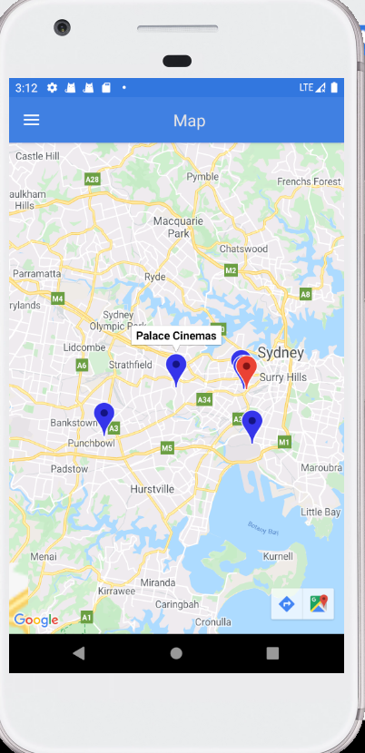

# MovieMemoir
本项目是基于Java开发的安卓app, 功能主要是提供电影搜索，电影查询，电影收藏，记录电影会议，条件查询，电影院位置map展现等功能。

# 项目简介
项目主要采用netBeans IDE 8.2自带的数据库 + glassfish4(类似tomcat), 用Android Studio编写前端和数据交互部分

API用到IMDB和google map service

# 项目截图
- 首页登录界面

 

- app主界面

- 电影搜索

- 电影详情

- 电影回忆

- 电影统计

- 电影收藏

- 电影院展示

- 用户注册

# 项目复现过程
1. 简历数据库（采用的是NetBeans上的derby）：
创建数据库使用sql.txt中的语句（附带数据）

2. 在netBeans创建项目：从数据库创建实体，创建RESTful Web service from Entity Classes.
把项目中的文件覆盖掉你的文件（里面主要添加了查询数据库的接口）

3. 用Android Studio下载项目并用gradle构建项目：构建项目之前改几个参数，确保能够正常访问

